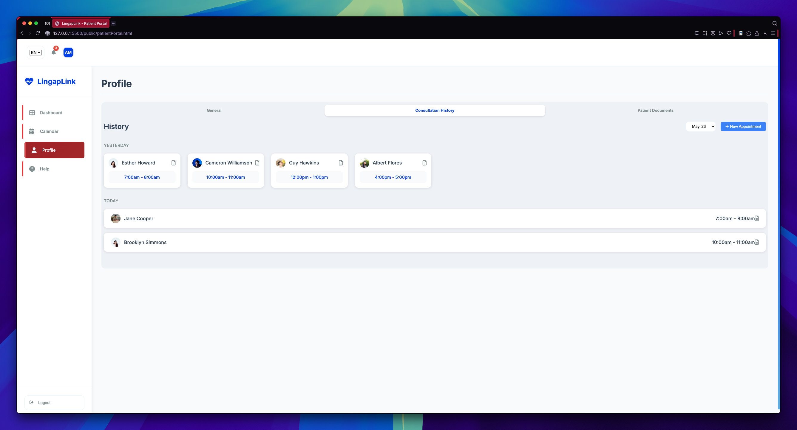
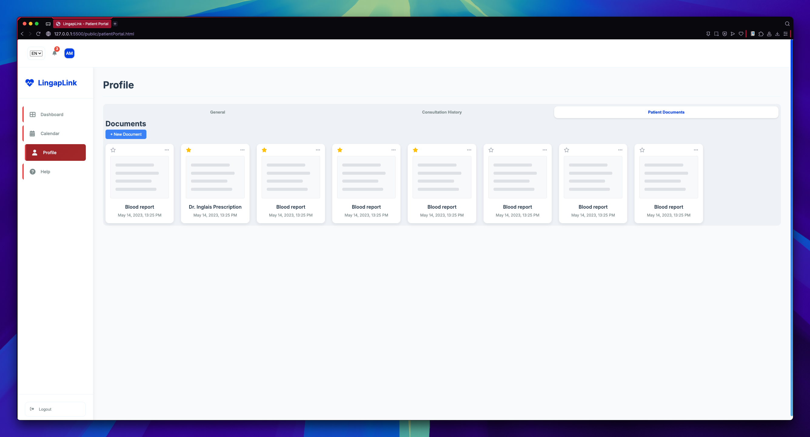
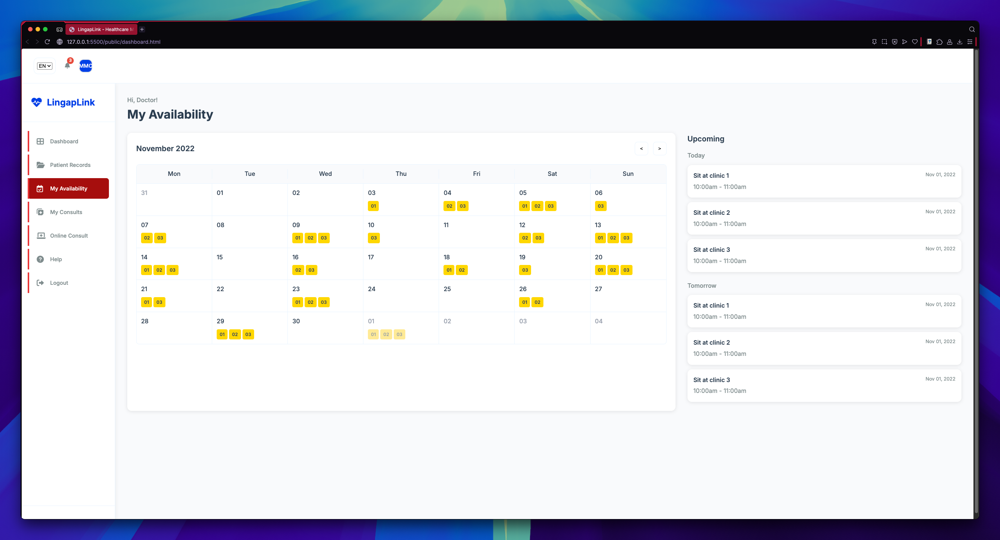
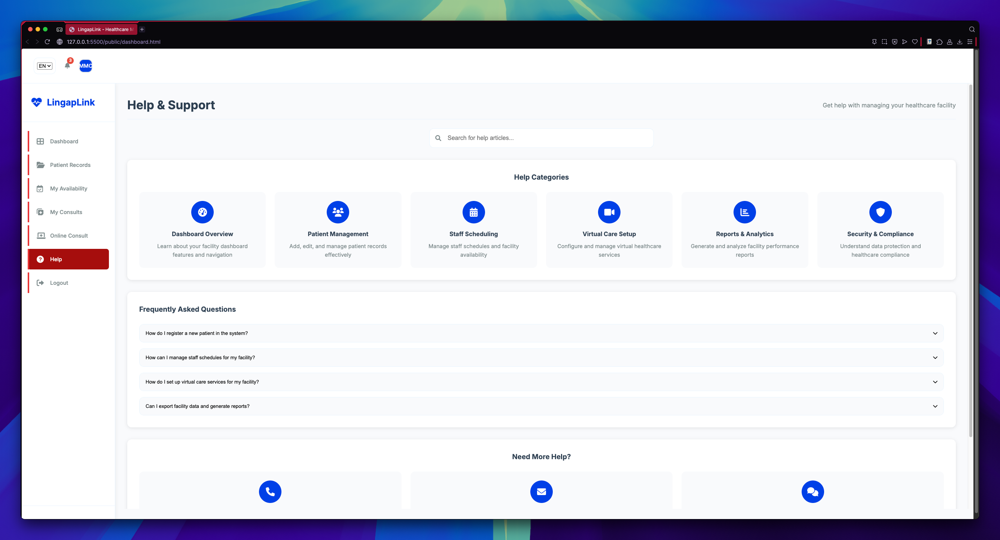
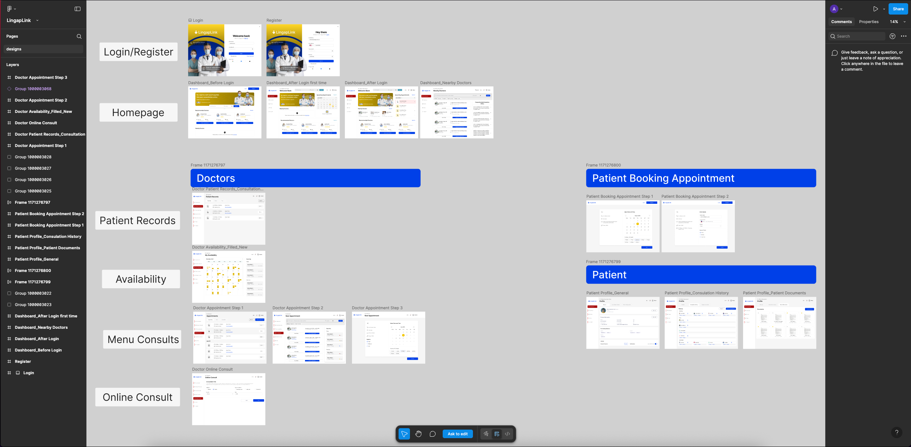
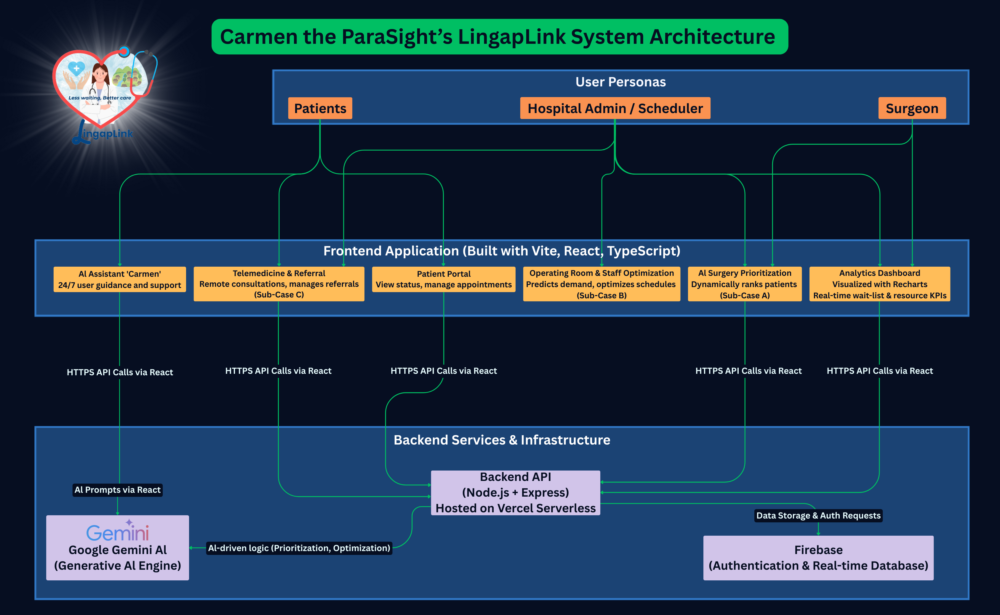

<div align="center">
  
</div>
<h1 align="center">LingapLink: Bridging Patients and Healthcare Providers</h1>

<p align="center">
  <a href="https://github.com/adr1el-m/carmen-para-sight/blob/main/LICENSE">
    
  </a>
  <a href="https://github.com/adr1el-m/carmen-para-sight/issues">
    
  </a>
  <a href="https://github.com/adr1el-m/carmen-para-sight/pulls">
    
  </a>
</p>

<p align="center">
  <!-- Make sure to update this with your live deployment URL -->
  <a href="https://lingap-link.vercel.app/">
    
  </a>
</p>

<details>
  <summary><strong>📚 Table of Contents</strong></summary>
  <br>
  <ol>
    <li><a href="#project-overview">Project Overview</a></li>
    <li><a href="#key-features">Key Features</a></li>
    <li><a href="#project-status-roadmap">Project Status & Roadmap</a></li>
    <li><a href="#screenshots">Screenshots</a></li>
    <li><a href="#figma-prototype">Figma Prototype</a></li>
    <li><a href="#system-architecture">System Architecture</a></li>
    <li><a href="#tech-stack">Tech Stack</a></li>
    <li><a href="#security">Security</a></li>
    <li>
      <a href="#getting-started">Getting Started</a>
      <ul>
        <li><a href="#prerequisites">Prerequisites</a></li>
        <li><a href="#installation">Installation</a></li>
      </ul>
    </li>
    <li><a href="#testing">Testing</a></li>
    <li><a href="#repository-structure">Repository Structure</a></li>
    <li><a href="#api-documentation">API Documentation</a></li>
    <li><a href="#contributing">Contributing</a></li>
    <li><a href="#meet-the-team">Meet the Team</a></li>
  </ol>
</details>

## 📝 Project Overview

LingapLink is a modern, web-based platform designed to bridge the gap between patients and healthcare providers, creating a seamless and efficient healthcare experience. Our mission is to simplify healthcare access by providing an intuitive interface where patients can easily find and connect with medical facilities, manage their health records, and schedule consultations.

For healthcare providers, LingapLink offers a powerful dashboard to manage patient records, streamline appointment scheduling, and organize virtual care services. By leveraging modern web technologies, we aim to deliver a reliable, secure, and user-friendly solution that enhances the quality of care and improves patient outcomes.

## ✨ Key Features

- **Patient Portal**: Securely manage personal health records, view medical history, and track appointments.
- **Provider Dashboard**: A comprehensive interface for healthcare professionals to manage patient information and schedules.
- **Appointment Scheduling**: An intuitive system for booking, rescheduling, and canceling appointments.
- **Secure Messaging**: HIPAA-compliant messaging for direct communication between patients and providers.
- **AI-Powered Insights**: Integration with Google Gemini for intelligent health analytics and support.

## 📈 Project Status & Roadmap


Our project is currently in active development. We are working hard to bring more features and improvements. Below is our roadmap, outlining the key features we plan to implement next.

### Roadmap

-   [ ] **Provider Analytics Dashboard**: Visualizing patient data and clinic performance.
-   [ ] **Telemedicine Integration**: Secure video consultations directly within the platform.
-   [ ] **Real-time Notifications**: SMS and email alerts for appointments and updates.
-   [ ] **Payment Gateway Integration**: For handling consultation fees and other services.
-   [ ] **Dedicated Mobile App**: A native mobile experience for patients and providers.
-   [ ] **Advanced AI Insights**: Deeper integration with AI for predictive health analytics.

We welcome contributions to help us achieve these goals!

## 📸 Screenshots

<p align="center">
  
</p>

### Patient Portal Screenshots

Here's a glimpse into the patient portal, showcasing the key features available to users.

<table width="100%">
  <tr>
    <td align="center" valign="top">
      <strong>Patient Dashboard</strong><br><br>
      
    </td>
    <td align="center" valign="top">
      <strong>Appointment Calendar</strong><br><br>
      
    </td>
  </tr>
  <tr>
    <td align="center" valign="top">
      <strong>Profile - General Information</strong><br><br>
      
    </td>
    <td align="center" valign="top">
      <strong>Profile - Consultation History</strong><br><br>
      
    </td>
  </tr>
    <tr>
    <td align="center" valign="top">
      <strong>Profile - Patient Documents</strong><br><br>
      
    </td>
    <td align="center" valign="top">
      <strong>Help & Support</strong><br><br>
      
    </td>
  </tr>
</table>

### Provider Dashboard Screenshots

Here's a look at the provider dashboard, designed for healthcare professionals to manage their workflow efficiently.

<table width="100%">
  <tr>
    <td align="center" valign="top">
      <strong>Provider Dashboard</strong><br><br>
      
    </td>
    <td align="center" valign="top">
      <strong>Patient Records</strong><br><br>
      
    </td>
  </tr>
  <tr>
    <td align="center" valign="top">
      <strong>My Availability</strong><br><br>
      
    </td>
    <td align="center" valign="top">
      <strong>My Consultations</strong><br><br>
      
    </td>
  </tr>
    <tr>
    <td align="center" valign="top">
      <strong>Online Consultations</strong><br><br>
      
    </td>
    <td align="center" valign="top">
      <strong>Help & Support</strong><br><br>
      
    </td>
  </tr>
</table>

## 🎨 Figma Prototype

Explore our high-fidelity prototype to see the user interface and experience our design vision.

<p align="center">
  <a href="https://www.figma.com/design/48AhpRLSp549mxywZipc9G/LingapLink?node-id=0-1&t=YDHJ15vmXcc3OMdW-1">
    
  </a>
</p>

<p align="center">
  
</p>

## 🏗️ System Architecture

Our platform is built on a robust and scalable architecture to ensure reliability and performance.

<p align="center">
  
</p>

## 🛠️ Tech Stack

This project is built with a modern technology stack, ensuring a high-quality and maintainable codebase.

| #  | Tool / Technology | Category | Description |
|----|---|---|---|
| 1  |  | Frontend | Structures the content and layout of all web pages. |
| 2  |   | Frontend | Styles the visual presentation of the application for a modern UI/UX. |
| 3  |   | Frontend/Backend | Powers the dynamic and interactive features on the client-side and server-side logic with Node.js. |
| 4  |   | Core Language | Enhances JavaScript with static types for improved code quality, maintainability, and developer experience. |
| 5  |   | Frontend | A JavaScript library for building user interfaces and interactive components. |
| 6  |   | Frontend | A utility-first CSS framework for rapidly building custom user interfaces. |
| 7  |  | Backend | Provides the JavaScript runtime environment for the server-side API. |
| 8  |  | Backend | A minimal and flexible Node.js web application framework used to build the application's API. |
| 9  |   | Database & Auth | Provides core backend services including Authentication and the Firestore database. |
| 10 |   | Database | A NoSQL, document-oriented database for storing all application data. |
| 11 |   | AI & ML | Powers intelligent, AI-driven features and insights within the platform. |
| 12 |   | AI & ML | Used for running and integrating large language models locally. |
| 13 |   | Tooling | A next-generation frontend build tool that provides a faster and leaner development experience. |
| 14 |   | Tooling | Statically analyzes code to quickly find and fix problems, ensuring code quality. |
| 15 |   | Tooling | An opinionated code formatter that enforces a consistent style across the entire codebase. |
| 16 |  | Deployment | A cloud platform for deploying the frontend application and serverless functions. |

## 🔒 Security

Security is a top priority for LingapLink, especially given the sensitive nature of health data. We have implemented several measures to protect user information:

-   **Data Encryption**: All data is encrypted in transit using HTTPS/TLS and encrypted at rest in Google Cloud's infrastructure, which is used by Firestore.
-   **HIPAA Compliance**: We are mindful of HIPAA requirements and have designed features like secure messaging to align with its privacy and security standards.
-   **Firebase Security Rules**: We leverage Firestore's powerful security rules to ensure that users can only access their own data, preventing unauthorized access at the database level.
-   **Secure Authentication**: User authentication is handled securely through Firebase Authentication, which provides a robust and reliable system for managing user identities.
-   **CSRF Protection**: We have implemented measures to protect against Cross-Site Request Forgery attacks, ensuring that state-changing requests are legitimate.
-   **Vulnerability Scanning**: We regularly scan our dependencies for known vulnerabilities to keep the platform secure.

## 🚀 Getting Started

To get a local copy up and running, follow these simple steps.

### Prerequisites

Make sure you have Node.js and npm installed on your machine.
* [Node.js](https://nodejs.org/) (which includes npm)

### Installation

1. Clone the repository:
   ```bash
   git clone https://github.com/adr1el-m/carmen-para-sight.git
   ```
2. Navigate to the project directory:
   ```bash
   cd carmen-para-sight
   ```
3. Install NPM packages:
   ```bash
   npm install
   ```
4. Create a `.env` file from the template and add your environment variables:
   ```bash
   cp env.template .env
   ```
5. Start the development server:
   ```bash
   npm run dev
   ```
This will launch the application in development mode. Open [http://localhost:5173](http://localhost:5173) to view it in your browser.

## 🧪 Testing

To ensure the quality and reliability of our application, we are in the process of setting up a comprehensive testing suite. Contributions in this area are highly welcome!

### Running Tests

You can run all tests using:
```bash
npm test
```
*Note: Please update the `package.json` with your testing scripts.*

### Our Testing Approach

-   **Unit Tests**: We aim to use [Jest/Vitest] for testing individual components and utility functions in isolation.
-   **Integration Tests**: To ensure seamless interaction between different services, like our authentication flow and database services.
-   **End-to-End (E2E) Tests**: We plan to use [Cypress/Playwright] to test critical user journeys across the application.

## 🗂️ Repository Structure

The project is organized into modular folders to separate concerns and improve maintainability. The structure is designed to clearly distinguish between public-facing pages, server-side logic, client-side scripts, and shared utilities.

```sh
LingapLink/
├── public/               # All client-facing HTML pages
│   ├── patientSign-in.html
│   ├── patientSign-up.html
│   ├── index.html
│   ├── businessSignIn.html
│   ├── patientPortal.html
│   ├── dashboard.html
│   └── businessRegistration.html
│
├── src/
│   ├── assets/           # Images, icons, and other static assets
│   │   └── img/
│   ├── config/           # Configuration files (e.g., Firebase)
│   │   └── firebase.ts
│   ├── pages/            # Page-specific JavaScript modules
│   │   ├── index.js
│   │   ├── dashboard.js
│   │   └── patientPortal.js
│   ├── services/         # Core application services
│   │   ├── auth-service.js
│   │   ├── firestoredb.js
│   │   └── organization-service.js
│   ├── styles/           # CSS stylesheets for each page
│   │   ├── index.css
│   │   ├── dashboard.css
│   │   └── patientPortal.css
│   └── utils/            # Shared utility scripts and helper functions
│       ├── auth-guard.js
│       ├── form-validation.js
│       └── logger.js
│
├── api/                  # Server-side logic and API endpoints
│   └── index.js
├── scripts/              # Build and utility scripts
│   └── verify-env.js
│
├── .env.template         # Environment variable template
├── firestore.rules       # Firebase security rules
├── package.json          # Project dependencies and scripts
└── README.md             # You are here
```

## 📄 API Documentation

Our API is built with Node.js and Express, providing the backend services for LingapLink. We are currently working on formalizing our API documentation.

The API handles core functionalities such as:
-   User Authentication (Sign-up, Sign-in)
-   Patient and Provider Data Management
-   Appointment Scheduling and Management

For more detailed information, you can explore the code in the `/api` directory. We plan to provide a full [Swagger/Postman](https://swagger.io/) documentation in the future.

## 🤝 Contributing

Contributions are what make the open-source community such an amazing place to learn, inspire, and create. Any contributions you make are **greatly appreciated**.

If you have a suggestion that would make this better, please fork the repo and create a pull request. You can also simply open an issue with the tag "enhancement".
Don't forget to give the project a star! Thanks again!

1. Fork the Project
2. Create your Feature Branch (`git checkout -b feature/AmazingFeature`)
3. Commit your Changes (`git commit -m 'Add some AmazingFeature'`)
4. Push to the Branch (`git push origin feature/AmazingFeature`)
5. Open a Pull Request

## 🤔‍💻 Meet the Team

<table align="center" border="0" cellpadding="0" cellspacing="0" width="100%">
  <tr>
    <td align="center" width="33.33%">
      <br>
      <strong>Threshia Andre Saut</strong><br>
      <a href="https://www.linkedin.com/in/threshia-saut-b74055316/">
        
      </a>
    </td>
    <td align="center" width="33.33%">
      <br>
      <strong>Franchezca Natividad Z. Banayad</strong><br>
      <a href="https://www.linkedin.com/in/franchezca-banayad/">
        
      </a>
    </td>
    <td align="center" width="33.33%">
      <br>
      <strong>Juanito Masam Ramos II</strong><br>
      <a href="https://www.linkedin.com/in/juanito-ramos/">
        
      </a>
    </td>
  </tr>
</table>
<table align="center" border="0" cellpadding="0" cellspacing="0" width="66.66%">
  <tr>
    <td align="center" width="50%" style="padding-top: 20px;">
      <br>
      <strong>Maxxinne Lorin M. Fernandez</strong><br>
      <a href="https://www.linkedin.com/in/maxxinne-fernandez-364776336/">
        
      </a>
    </td>
    <td align="center" width="50%" style="padding-top: 20px;">
      <br>
      <strong>Adriel Magsipoc Magalona</strong><br>
      <a href="https://www.linkedin.com/in/adriel-magalona/">
        
      </a>
    </td>
  </tr>
</table>

