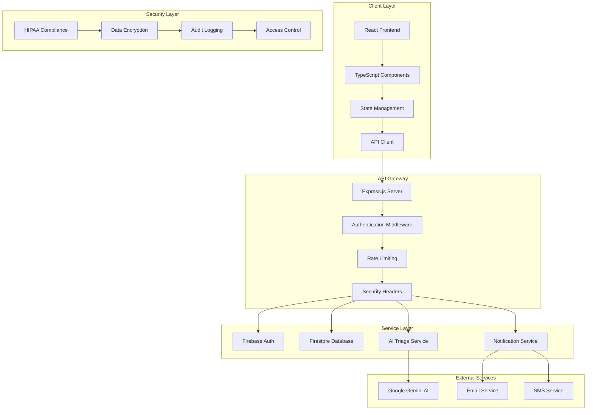

<div align="center">
  
  
  <h1>LingapLink</h1>
  <h3>Bridging Patients and Healthcare Providers</h3>
  
  <p align="center">
    
    
    
    
  </p>
  
  <p align="center">
    <a href="#-features">Features</a> •
    <a href="#-quick-start">Quick Start</a> •
    <a href="#-documentation">Documentation</a> •
    <a href="#-contributing">Contributing</a> •
    <a href="#-team">Team</a>
  </p>
</div>

---

## 📋 Table of Contents

- [Overview](#-overview)
- [Features](#-features)
- [Technology Stack](#-technology-stack)
- [System Architecture](#-system-architecture)
- [Quick Start](#-quick-start)
- [Installation](#-installation)
- [Configuration](#-configuration)
- [API Documentation](#-api-documentation)
- [Security & Compliance](#-security--compliance)
- [Testing](#-testing)
- [Deployment](#-deployment)
- [Contributing](#-contributing)
- [Team](#-team)
- [License](#-license)

## 🎯 Overview

**LingapLink** is a comprehensive, modern healthcare platform designed to revolutionize the connection between patients and healthcare providers. Built with cutting-edge web technologies and a focus on security, accessibility, and user experience, LingapLink streamlines healthcare delivery through intelligent automation and seamless digital workflows.

### Mission Statement

To democratize healthcare access by providing an intuitive, secure, and efficient platform that empowers both patients and healthcare providers to deliver and receive quality care through technology-driven solutions.

### Key Value Propositions

- **Patient-Centric Design**: Intuitive interfaces that prioritize user experience and accessibility
- **Provider Efficiency**: Comprehensive dashboards that streamline clinical workflows
- **AI-Powered Intelligence**: Smart triage and analytics powered by Google Gemini AI
- **Enterprise Security**: HIPAA-compliant infrastructure with enterprise-grade security
- **Scalable Architecture**: Built to handle growth from individual practices to large healthcare systems

## ✨ Features

### 🏥 Patient Portal
- **Comprehensive Health Records**: Secure management of personal health information, medical history, and documents
- **Smart Appointment Scheduling**: AI-assisted appointment booking with intelligent time slot recommendations
- **Real-time Communication**: HIPAA-compliant messaging system for direct provider communication
- **Health Analytics**: Personalized health insights and trend analysis
- **Document Management**: Secure upload, storage, and sharing of medical documents
- **Prescription Tracking**: Digital prescription management and medication reminders

### 👨‍⚕️ Provider Dashboard
- **Patient Management**: Comprehensive patient records with advanced search and filtering
- **Appointment Management**: Intelligent scheduling system with conflict detection and optimization
- **AI-Powered Triage**: Automated patient prioritization based on symptoms and urgency levels
- **Clinical Analytics**: Performance metrics, patient outcomes, and operational insights
- **Telemedicine Integration**: Built-in video consultation capabilities
- **Compliance Monitoring**: HIPAA compliance tracking and audit trails

### 🤖 AI & Automation
- **Intelligent Triage System**: Google Gemini AI-powered patient assessment and prioritization
- **Predictive Analytics**: Health trend analysis and risk assessment
- **Automated Notifications**: Smart alerts for appointments, medication, and health milestones
- **Natural Language Processing**: AI-powered symptom analysis and preliminary diagnosis support
- **Performance Optimization**: Automated system monitoring and performance tuning

### 🔒 Security & Compliance
- **HIPAA Compliance**: Full compliance with healthcare data protection regulations
- **End-to-End Encryption**: All data encrypted in transit and at rest
- **Multi-Factor Authentication**: Enhanced security with MFA support
- **Audit Logging**: Comprehensive activity tracking and compliance reporting
- **Role-Based Access Control**: Granular permissions and access management
- **Data Privacy**: GDPR and CCPA compliant data handling

## 📈 Project Status & Roadmap


Our project is currently in active development. We are working hard to bring more features and improvements. Below is our roadmap, outlining the key features we plan to implement next.

### Roadmap

- [ ] **Provider Analytics Dashboard**: Visualizing patient data and clinic performance.
- [ ] **Telemedicine Integration**: Secure video consultations directly within the platform.
- [ ] **Real-time Notifications**: SMS and email alerts for appointments and updates.
- [ ] **Payment Gateway Integration**: For handling consultation fees and other services.
- [ ] **Dedicated Mobile App**: A native mobile experience for patients and providers.
- [ ] **Advanced AI Insights**: Deeper integration with AI for predictive health analytics.

We welcome contributions to help us achieve these goals!

## 📸 Screenshots

<p align="center">
  
</p>

### Patient Portal Screenshots

Here's a glimpse into the patient portal, showcasing the key features available to users.

<table width="100%">
  <tr>
    <td align="center" valign="top">
      <strong>Patient Dashboard</strong><br><br>
      
    </td>
    <td align="center" valign="top">
      <strong>Appointment Calendar</strong><br><br>
      
    </td>
  </tr>
  <tr>
    <td align="center" valign="top">
      <strong>Profile - General Information</strong><br><br>
      
    </td>
    <td align="center" valign="top">
      <strong>Profile - Consultation History</strong><br><br>
      
    </td>
  </tr>
    <tr>
    <td align="center" valign="top">
      <strong>Profile - Patient Documents</strong><br><br>
      
    </td>
    <td align="center" valign="top">
      <strong>Help & Support</strong><br><br>
      
    </td>
  </tr>
</table>

### Provider Dashboard Screenshots

Here's a look at the provider dashboard, designed for healthcare professionals to manage their workflow efficiently.

<table width="100%">
  <tr>
    <td align="center" valign="top">
      <strong>Provider Dashboard</strong><br><br>
      
    </td>
    <td align="center" valign="top">
      <strong>Patient Records</strong><br><br>
      
    </td>
  </tr>
  <tr>
    <td align="center" valign="top">
      <strong>My Availability</strong><br><br>
      
    </td>
    <td align="center" valign="top">
      <strong>My Consultations</strong><br><br>
      
    </td>
  </tr>
    <tr>
    <td align="center" valign="top">
      <strong>Online Consultations</strong><br><br>
      
    </td>
    <td align="center" valign="top">
      <strong>Help & Support</strong><br><br>
      
    </td>
  </tr>
</table>

## 🎨 Figma Prototype

Explore our high-fidelity prototype to see the user interface and experience our design vision.

<p align="center">
  <a href="https://www.figma.com/design/48AhpRLSp549mxywZipc9G/LingapLink?node-id=0-1&t=YDHJ15vmXcc3OMdW-1">
    
  </a>
</p>

<p align="center">
  
</p>

## 🏗️ System Architecture

LingapLink follows a modern, scalable architecture pattern designed for healthcare applications:



### Architecture Principles

- **Microservices-Ready**: Modular design allowing for easy service extraction
- **Event-Driven**: Asynchronous processing for better scalability
- **Security-First**: Every component designed with security in mind
- **Cloud-Native**: Built for cloud deployment and auto-scaling
- **API-First**: RESTful APIs with comprehensive documentation

<p align="center">
  
</p>

## 🛠️ Technology Stack

### Frontend
| Technology | Version | Purpose |
|------------|---------|---------|
|  | 18.3.1 | Modern UI framework with hooks and context |
|  | 5.8.3 | Type-safe JavaScript development |
|  | 6.3.5 | Fast build tool and development server |
|  | 6.24.1 | Client-side routing and navigation |
|  | 0.523.0 | Modern icon library |
|  | 3.0.0 | Data visualization and analytics |

<<<<<<< HEAD
### Backend & Services
| Technology | Version | Purpose |
|------------|---------|---------|
|  | 20+ | JavaScript runtime environment |
|  | 4.19.2 | Web application framework |
|  | 11.9.1 | Backend-as-a-Service platform |
|  | 11.9.1 | NoSQL document database |
|  | 0.24.1 | AI/ML services and natural language processing |

### Development & Quality
| Technology | Version | Purpose |
|------------|---------|---------|
|  | 9.29.0 | Code linting and quality assurance |
|  | 3.6.0 | Code formatting and style consistency |
|  | 2.1.8 | Fast unit testing framework |
|  | 16.1.0 | React component testing utilities |
=======
| #   | Tool / Technology                                                                                                                            | Category         | Description                                                                                                 |
| --- | -------------------------------------------------------------------------------------------------------------------------------------------- | ---------------- | ----------------------------------------------------------------------------------------------------------- |
| 1   |                          | Frontend         | Structures the content and layout of all web pages.                                                         |
| 2   |                             | Frontend         | Styles the visual presentation of the application for a modern UI/UX.                                       |
| 3   |           | Frontend/Backend | Powers the dynamic and interactive features on the client-side and server-side logic with Node.js.          |
| 4   |           | Core Language    | Enhances JavaScript with static types for improved code quality, maintainability, and developer experience. |
| 5   |                          | Frontend         | A JavaScript library for building user interfaces and interactive components.                               |
| 6   |     | Frontend         | A utility-first CSS framework for rapidly building custom user interfaces.                                  |
| 7   |                    | Backend          | Provides the JavaScript runtime environment for the server-side API.                                        |
| 8   |                    | Backend          | A minimal and flexible Node.js web application framework used to build the application's API.               |
| 9   |                 | Database & Auth  | Provides core backend services including Authentication and the Firestore database.                         |
| 10  |               | Database         | A NoSQL, document-oriented database for storing all application data.                                       |
| 11  |  | AI & ML          | Powers intelligent, AI-driven features and insights within the platform.                                    |

| 12 |  | Tooling | A next-generation frontend build tool that provides a faster and leaner development experience. |
| 13 |  | Tooling | Statically analyzes code to quickly find and fix problems, ensuring code quality. |
| 14 |  | Tooling | An opinionated code formatter that enforces a consistent style across the entire codebase. |
| 15 |  | Deployment | A cloud platform for deploying the frontend application and serverless functions. |
>>>>>>> 4531d778873a0e34952dcc5aa02eda64c9a49d3a

### Security & Performance
| Technology | Version | Purpose |
|------------|---------|---------|
|  | 7.1.0 | Security headers and middleware |
|  | 9.0.2 | Secure authentication tokens |
|  | 7.1.5 | API rate limiting and abuse prevention |
|  | 3.0.8 | XSS protection and HTML sanitization |

## 🔒 Security & Compliance

<<<<<<< HEAD
### HIPAA Compliance
=======
- **Data Encryption**: All data is encrypted in transit using HTTPS/TLS and encrypted at rest in Google Cloud's infrastructure, which is used by Firestore.
- **HIPAA Compliance**: We are mindful of HIPAA requirements and have designed features like secure messaging to align with its privacy and security standards.
- **Firebase Security Rules**: We leverage Firestore's powerful security rules to ensure that users can only access their own data, preventing unauthorized access at the database level.
- **Secure Authentication**: User authentication is handled securely through Firebase Authentication, which provides a robust and reliable system for managing user identities.
- **CSRF Protection**: We have implemented measures to protect against Cross-Site Request Forgery attacks, ensuring that state-changing requests are legitimate.
- **Vulnerability Scanning**: We regularly scan our dependencies for known vulnerabilities to keep the platform secure.
>>>>>>> 4531d778873a0e34952dcc5aa02eda64c9a49d3a

LingapLink is designed with HIPAA compliance as a core requirement:

- **Administrative Safeguards**: Role-based access control and audit logging
- **Physical Safeguards**: Cloud-based infrastructure with physical security
- **Technical Safeguards**: End-to-end encryption and secure authentication

### Security Features

- **Data Encryption**: AES-256 encryption for data at rest, TLS 1.3 for data in transit
- **Authentication**: Multi-factor authentication support
- **Authorization**: Role-based access control (RBAC)
- **Audit Logging**: Comprehensive activity tracking
- **Vulnerability Management**: Regular security scans and updates
- **Incident Response**: Automated security monitoring and alerting

### Privacy Controls

- **Data Minimization**: Collect only necessary health information
- **Consent Management**: Granular consent tracking and management
- **Right to Access**: Patient data portability and access controls
- **Data Retention**: Configurable data retention policies
- **Breach Notification**: Automated breach detection and notification

## 🚀 Deployment

### Production Deployment

#### Vercel Deployment (Recommended)

```bash
# Install Vercel CLI
npm install -g vercel

# Deploy to Vercel
vercel --prod
```

#### Manual Deployment

```bash
# Build the application
npm run build

# Start production server
npm start
```

### Environment-Specific Configuration

- **Development**: Local development with hot reloading
- **Staging**: Pre-production testing environment
- **Production**: Live environment with full security measures

### Monitoring & Observability

- **Application Monitoring**: Real-time performance metrics
- **Error Tracking**: Automated error detection and reporting
- **Security Monitoring**: Intrusion detection and prevention
- **Compliance Monitoring**: HIPAA compliance tracking

## 🚀 Quick Start

### Prerequisites

<<<<<<< HEAD
- **Node.js** 20.0.0 or higher
- **npm** 10.0.0 or higher
- **Firebase Project** with Firestore enabled
- **Google Cloud Account** for Gemini AI services
=======
Make sure you have Node.js and npm installed on your machine.

- [Node.js](https://nodejs.org/) (which includes npm)
>>>>>>> 4531d778873a0e34952dcc5aa02eda64c9a49d3a

### 1-Minute Setup

```bash
# Clone the repository
git clone https://github.com/adr1el-m/carmen-the-parasight.git
cd carmen-the-parasight

# Install dependencies
npm install

# Configure environment
cp env.template .env.local
# Edit .env.local with your Firebase and Gemini API keys

# Start development server
npm run dev
```

Visit `http://localhost:5173` to see LingapLink in action!

## 📦 Installation

### Detailed Setup Instructions

1. **Clone the Repository**
   ```bash
   git clone https://github.com/adr1el-m/carmen-the-parasight.git
   cd carmen-the-parasight
   ```

2. **Install Dependencies**
   ```bash
   npm install
   ```

3. **Environment Configuration**
   ```bash
   cp env.template .env.local
   ```
   
   Configure the following variables in `.env.local`:
   ```env
   # Firebase Configuration
   VITE_FIREBASE_API_KEY=your_firebase_api_key
   VITE_FIREBASE_AUTH_DOMAIN=your_project.firebaseapp.com
   VITE_FIREBASE_PROJECT_ID=your_project_id
   VITE_FIREBASE_STORAGE_BUCKET=your_project.appspot.com
   VITE_FIREBASE_MESSAGING_SENDER_ID=your_sender_id
   VITE_FIREBASE_APP_ID=your_app_id
   
   # AI Services
   VITE_ENABLE_AI_TRIAGE=true
   VITE_GEMINI_API_KEY=your_gemini_api_key
   
   # Application Settings
   VITE_APP_NAME=LingapLink
   VITE_APP_VERSION=1.0.0
   ```

4. **Firebase Setup**
   ```bash
   # Install Firebase CLI
   npm install -g firebase-tools
   
   # Login to Firebase
   firebase login
   
   # Initialize Firebase (if not already done)
   firebase init
   ```

5. **Start Development Server**
   ```bash
   npm run dev
   ```
<<<<<<< HEAD

## ⚙️ Configuration

### Firebase Configuration

1. Create a new Firebase project at [Firebase Console](https://console.firebase.google.com/)
2. Enable Authentication with Email/Password provider
3. Create a Firestore database in production mode
4. Configure security rules (see `firestore.rules`)
5. Generate web app configuration and add to `.env.local`

### AI Triage Configuration

1. Create a Google Cloud project
2. Enable the Generative AI API
3. Create an API key with appropriate permissions
4. Add the API key to your `.env.local` file

### Security Configuration

The application includes comprehensive security measures:

- **Content Security Policy (CSP)** headers
- **Rate limiting** on all API endpoints
- **Input validation** and sanitization
- **XSS protection** with DOMPurify
- **CSRF protection** for state-changing operations
=======
   This will launch the application in development mode. Open [http://localhost:5173](http://localhost:5173) to view it in your browser.
>>>>>>> 4531d778873a0e34952dcc5aa02eda64c9a49d3a

## 🧪 Testing

### Test Suite Overview

LingapLink includes a comprehensive testing strategy:

<<<<<<< HEAD
=======
You can run all tests using:

>>>>>>> 4531d778873a0e34952dcc5aa02eda64c9a49d3a
```bash
# Run all tests
npm test

# Run tests with coverage
npm run test:coverage

# Run tests in watch mode
npm run test:watch

# Run tests with UI
npm run test:ui
```
<<<<<<< HEAD
=======

_Note: Please update the `package.json` with your testing scripts._
>>>>>>> 4531d778873a0e34952dcc5aa02eda64c9a49d3a

### Testing Strategy

<<<<<<< HEAD
- **Unit Tests**: Component and utility function testing with Vitest
- **Integration Tests**: API endpoint and service integration testing
- **End-to-End Tests**: Critical user journey testing
- **Security Tests**: Authentication and authorization testing
- **Performance Tests**: Load testing and performance benchmarking

### Test Coverage Goals

- **Code Coverage**: >90% for critical components
- **API Coverage**: 100% endpoint coverage
- **Security Tests**: All authentication and authorization paths
- **Accessibility Tests**: WCAG 2.1 AA compliance
=======
- **Unit Tests**: We aim to use [Jest/Vitest] for testing individual components and utility functions in isolation.
- **Integration Tests**: To ensure seamless interaction between different services, like our authentication flow and database services.
- **End-to-End (E2E) Tests**: We plan to use [Cypress/Playwright] to test critical user journeys across the application.
>>>>>>> 4531d778873a0e34952dcc5aa02eda64c9a49d3a

## 🗂️ Repository Structure

The project is organized into modular folders to separate concerns and improve maintainability. The structure is designed to clearly distinguish between public-facing pages, server-side logic, client-side scripts, and shared utilities.

```sh
LingapLink/
├── public/               # All client-facing HTML pages
│   ├── patientSign-in.html
│   ├── patientSign-up.html
│   ├── index.html
│   ├── businessSignIn.html
│   ├── patientPortal.html
│   ├── dashboard.html
│   └── businessRegistration.html
│
├── src/
│   ├── assets/           # Images, icons, and other static assets
│   │   └── img/
│   ├── config/           # Configuration files (e.g., Firebase)
│   │   └── firebase.ts
│   ├── pages/            # Page-specific JavaScript modules
│   │   ├── index.js
│   │   ├── dashboard.js
│   │   └── patientPortal.js
│   ├── services/         # Core application services
│   │   ├── auth-service.js
│   │   ├── firestoredb.js
│   │   └── organization-service.js
│   ├── styles/           # CSS stylesheets for each page
│   │   ├── index.css
│   │   ├── dashboard.css
│   │   └── patientPortal.css
│   └── utils/            # Shared utility scripts and helper functions
│       ├── auth-guard.js
│       ├── form-validation.js
│       └── logger.js
│
├── api/                  # Server-side logic and API endpoints
│   └── index.js
├── scripts/              # Build and utility scripts
│   └── verify-env.js
│
├── .env.template         # Environment variable template
├── firestore.rules       # Firebase security rules
├── package.json          # Project dependencies and scripts
└── README.md             # You are here
```

## 📚 API Documentation

### Authentication Endpoints

<<<<<<< HEAD
```http
POST /api/auth/signup
POST /api/auth/signin
POST /api/auth/signout
GET  /api/auth/verify
```
=======
The API handles core functionalities such as:

- User Authentication (Sign-up, Sign-in)
- Patient and Provider Data Management
- Appointment Scheduling and Management
>>>>>>> 4531d778873a0e34952dcc5aa02eda64c9a49d3a

### Patient Management

```http
GET    /api/patients              # List patients
GET    /api/patients/:id          # Get patient details
PUT    /api/patients/:id          # Update patient
DELETE /api/patients/:id          # Delete patient
POST   /api/patients/:id/documents # Upload documents
```

### Appointment Management

```http
GET    /api/appointments          # List appointments
POST   /api/appointments          # Create appointment
PUT    /api/appointments/:id      # Update appointment
DELETE /api/appointments/:id      # Cancel appointment
GET    /api/appointments/calendar # Get calendar view
```

### AI Triage Service

```http
POST   /api/triage/evaluate       # Evaluate patient urgency
GET    /api/triage/status         # Get triage system status
POST   /api/triage/feedback       # Submit triage feedback
```

### Analytics & Reporting

```http
GET    /api/analytics/dashboard   # Dashboard metrics
GET    /api/analytics/patients    # Patient analytics
GET    /api/analytics/appointments # Appointment analytics
GET    /api/analytics/compliance  # Compliance reports
```

## 🤝 Contributing

We welcome contributions from the community! Please read our contributing guidelines before submitting pull requests.

### Development Workflow

1. **Fork the Repository**
   ```bash
   git fork https://github.com/adr1el-m/carmen-the-parasight.git
   ```

2. **Create a Feature Branch**
   ```bash
   git checkout -b feature/amazing-feature
   ```

<<<<<<< HEAD
3. **Make Your Changes**
   - Follow our coding standards
   - Add tests for new functionality
   - Update documentation as needed

4. **Run Quality Checks**
   ```bash
   npm run lint
   npm run test
   npm run type-check
   ```

5. **Commit Your Changes**
   ```bash
   git commit -m "Add amazing feature"
   ```

6. **Push to Your Fork**
   ```bash
   git push origin feature/amazing-feature
   ```

7. **Create a Pull Request**

### Code Standards

- **TypeScript**: Strict type checking enabled
- **ESLint**: Enforced code quality rules
- **Prettier**: Consistent code formatting
- **Testing**: Required for all new features
- **Documentation**: Comprehensive inline documentation

### Issue Reporting

When reporting issues, please include:

- **Environment**: OS, Node.js version, browser
- **Steps to Reproduce**: Detailed reproduction steps
- **Expected Behavior**: What should happen
- **Actual Behavior**: What actually happens
- **Screenshots**: If applicable
- **Logs**: Relevant error logs

## 👥 Team

<div align="center">

| **Threshia Andre Saut** | **Franchezca Natividad Z. Banayad** | **Juanito Masam Ramos II** |
|:---:|:---:|:---:|
|  |  |  |
| **Lead Developer** | **UI/UX Designer** | **Backend Engineer** |
| [](https://www.linkedin.com/in/threshia-saut-b74055316/) | [](https://www.linkedin.com/in/franchezca-natividad-banayad-25b278261) | [](https://www.linkedin.com/in/juanito-ramos/) |

| **Maxxinne Lorin M. Fernandez** | **Adriel Magsipoc Magalona** |
|:---:|:---:|
|  |  |
| **Security Engineer** | **Full-Stack Developer** |
| [](https://www.linkedin.com/in/maxxinne-fernandez-364776336/) | [](https://www.linkedin.com/in/adriel-magalona/) |

</div>

### Team Expertise

- **Frontend Development**: React, TypeScript, modern web technologies
- **Backend Development**: Node.js, Express, Firebase, cloud services
- **UI/UX Design**: Healthcare-focused user experience design
- **Security Engineering**: HIPAA compliance, healthcare security standards
- **AI/ML Integration**: Google Gemini AI, healthcare analytics

## 📄 License

This project is licensed under the MIT License - see the [LICENSE.md](LICENSE.md) file for details.

## 🙏 Acknowledgments

- **Google Firebase** for providing robust backend services
- **Google Gemini AI** for intelligent healthcare features
- **React Community** for excellent documentation and tools
- **Healthcare Professionals** who provided valuable feedback and requirements
- **Open Source Community** for the amazing tools and libraries

## 📞 Support

- **Documentation**: [Project Wiki](https://github.com/adr1el-m/carmen-the-parasight/wiki)
- **Issues**: [GitHub Issues](https://github.com/adr1el-m/carmen-the-parasight/issues)
- **Discussions**: [GitHub Discussions](https://github.com/adr1el-m/carmen-the-parasight/discussions)
- **Email**: support@lingaplink.com

---

<div align="center">
  <p>Made with ❤️ for better healthcare</p>
  <p>
    <a href="#-overview">Back to Top</a>
  </p>
</div>

=======
<table align="center" border="0" cellpadding="0" cellspacing="0" width="100%">
  <tr>
    <td align="center" width="33.33%">
      <br>
      <strong>Threshia Andre Saut</strong><br>
      <a href="https://www.linkedin.com/in/threshia-saut-b74055316/">
        
      </a>
    </td>
    <td align="center" width="33.33%">
      <br>
      <strong>Franchezca Natividad Z. Banayad</strong><br>
      <a href="https://www.linkedin.com/in/franchezca-natividad-banayad-25b278261">
        
      </a>
    </td>
    <td align="center" width="33.33%">
      <br>
      <strong>Juanito Masam Ramos II</strong><br>
      <a href="https://www.linkedin.com/in/juanito-ramos/">
        
      </a>
    </td>
  </tr>
</table>
<table align="center" border="0" cellpadding="0" cellspacing="0" width="66.66%">
  <tr>
    <td align="center" width="50%" style="padding-top: 20px;">
      <br>
      <strong>Maxxinne Lorin M. Fernandez</strong><br>
      <a href="https://www.linkedin.com/in/maxxinne-fernandez-364776336/">
        
      </a>
    </td>
    <td align="center" width="50%" style="padding-top: 20px;">
      <br>
      <strong>Adriel Magsipoc Magalona</strong><br>
      <a href="https://www.linkedin.com/in/adriel-magalona/">
        
      </a>
    </td>
  </tr>
</table>
>>>>>>> 4531d778873a0e34952dcc5aa02eda64c9a49d3a
